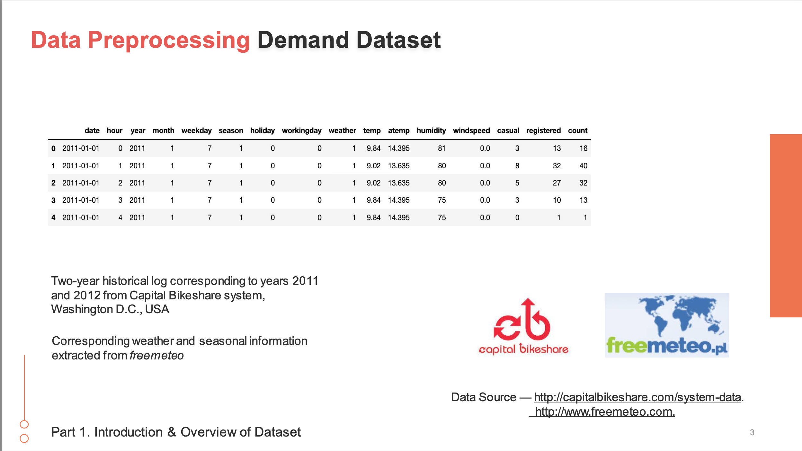
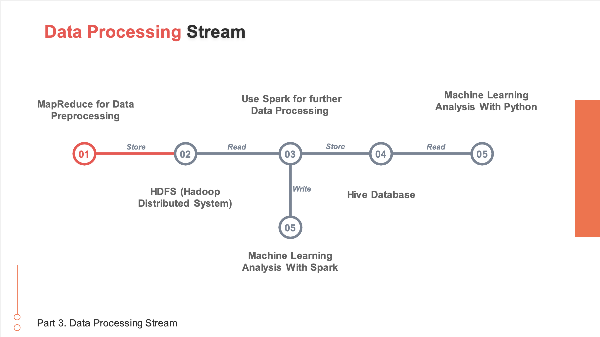

<div align="center">
  
</div>
 

**City University of Hong Kong** 

**CS4480 Data Intensive Computing** 

**Group 14** 

## Parallel Computing on Bike Sharing Demand Dataset

 

Student IDs : 56642728;56641664; 56644501 

Student Names : LUO Peiyuan; LI Yiheng; ZHOU Xin 

Student Emails : peiyualuo2-c@my.cityu.edu.hk; yihengli5-c@my.cityu.edu.hk; xzhou86-c@my.cityu.edu.hk 

 

### List of Deliverables


|  |  |
| --- | --- |
| **File/Folder Name**  | **Description**  |
| CS4480 Project Report.pdf  | Main Project Report  |
| Code  | Project Code  |
| CS4480 Presentation.pdf  | Presentation Slide  |

 

 
### Table of Contents

***1. Introduction***

**1.1 Motivation**

**1.2 Objective**

**1.3 Data Sources**

***2. Explanatory Data Analysis***

**2.1 Outlier Analysis:**

**2.2 Correlation Analysis**

***3. Methodology***

**3.1 Data Processing Pipeline**

**3.2 Data Preprocessing using MapReduce**

*3.2.1 Reducer Phase*

*3.2.2 Mapping Phase*

**3.4 Further Data Processing with Spark**

*3.4.1 Defining the schema*

*3.4.2 Reading data from HDFS*

*3.4.3 Data preprocessing*

*3.4.3 Saving preprocessed data into Hive tables*

**3.5 Machine Learning Models**

*3.5.1 Linear Regression*

*3.5.2 Random Forest*

*3.5.3 Gradient Boost*

*3.5.4 MultiLayer Perceptron*

***4. Discussion***

**4.1 Result Analysis**

**4.2 Future Work**

*4.2.1 Model capability for dynamic data analysis*

*4.2.2 Performance Optimization*

***5. Conclusion***

***6. Reference***

***7. Individual Contribution***

**7. 1 Individual Contribution Table**

**7.2 Individual Contribution Statement**
***8. Presentation***
 

### 1.1 Motivation

In recent years, bike-sharing systems have rapidly become a cornerstone of urban transportation, profoundly altering the landscape of city commuting. Characterized by flexibility and environmental friendliness, these systems present an innovative solution to the challenges of urban mobility. Our study seeks to delve into the users’ demands and rental patterns of these systems, utilizing a data-centric approach to unravel the complexities inherent in managing and optimizing such dynamic systems. 

 

Our project is driven by the multifaceted nature of bike-sharing systems, embodying both remarkable potential and significant challenges. In countries like the United States, where regulatory frameworks are robust, bike-sharing systems have seen widespread adoption and success. Conversely, in densely populated countries like China, these systems encounter unique challenges, ranging from logistical issues such as bicycle oversupply and parking management to socio-economic concerns like vandalism and equitable access. Our study is motivated by the need to address these challenges, aiming to provide actionable insights that can inform policy decisions and strategic planning for the effective management of bike-sharing systems 

 

 

### 1.2 Objective

The core objective of our study is an in-depth analysis of the Capital Bikeshare program, a pioneering bikesharing initiative in Washington D.C., launched in 2010. We aim to dissect various dimensions influencing bike rental activities, such as temporal variations, weather impacts, and user demographics. Our analysis intends not only to understand the current operational effectiveness of the system but also to identify potential areas for improvement and innovation. By doing so, we aspire to contribute valuable insights to the ongoing discourse on sustainable urban transportation and to propose data-driven strategies for enhancing the efficacy and user experience of bike-sharing systems. 

 

 

 

### 1.3 Data Sources

Our research is anchored in a meticulously compiled dataset from the Capital Bikeshare system, encompassing a rich array of data points collected over two years, from 2011 to 2014. This dataset underwent a rigorous preprocessing phase, where we meticulously examined data quality, consistency, and relevance. The 2011-2012 segment of the dataset emerged as particularly suitable for our analysis, characterized by its comprehensive nature and reduced incidence of outliers. This segment includes extensive information on rental frequencies, time stamps, weather conditions, and other pertinent variables. Through a detailed exploration of this dataset, we aim to extract meaningful patterns and correlations that can illuminate the operational dynamics of bike-sharing systems. 

 

 

# 2. Explanatory Data Analysis

In our EDA, we placed a significant focus on outlier analysis and correlation analysis, supplemented by visual aids to better understand the dataset's characteristics and relationships. 

 

### 2.1 Outlier Analysis

Our initial step was to identify and handle outliers in the "count" variable, as these can skew the data's overall analysis. We utilized boxplots to visually detect these outliers. The presence of outliers was evident, especially on working days, and during typical commuting hours. By addressing these outliers, we could ensure a more accurate representation of the dataset's central tendencies. The revised dataset, with outliers managed, offers a more reliable foundation for further analysis. 

 

The accompanying boxplots illustrate this process, highlighting key periods like the spring season with notably lower bike counts and peak times at 7AM-8AM and 5PM-6PM, which align with regular school and office commuting hours. 

 

### 2.2 Correlation Analysis


Following the outlier management, we conducted a correlation analysis to identify relationships between various factors and bike rentals. This included examining how "temp," "humidity," and "windspeed" correlated with bike rental counts. "Temp" showed a positive correlation, implying higher rentals during warmer temperatures, whereas "humidity" had a negative impact on rental counts. "Windspeed" appeared to have a negligible correlation. 

 

This analysis was crucial for understanding user behavior and rental patterns, such as higher demand during summer months and peak rental times on weekdays, likely due to commuters. The data suggested that weekends had a different rental pattern, with a consistent number of rentals from late morning to afternoon. 

 

These findings from our EDA provided a comprehensive understanding of the dataset and informed our approach to developing a robust methodology for further analysis. 

 

 

# 3. Methodology

### 3.1 Data Processing Pipeline

 

 

 

The figure illustrates the data processing pipeline employed in our project. The data processing pipeline involves these stages below: 

 

**Data Preprocessing with MapReduce:** To ensure data quality and consistency, we performed data preprocessing using the MapReduce framework including missing value analysis and removal of outliers. 

 

**HDFS Storage:** After preprocessing, the preprocessed data is stored in the Hadoop Distributed File System (HDFS). 

 

**Spark Processing:** We used Spark to conduct additional data processing operations on the data retrieved from HDFS, and subsequently wrote the processed data into a Hive Database. This step included dividing the date data into separate day, month, and year to facilitate the later analysis. 

 

**Hive Database Integration:** we wrote the processed data into a Hive Database for further analysis. 

 

**Machine Analysis with Python and Spark:** Finally, we conducted machine analysis using Python and Spark (Scala). We used keras. models.Sequential to perform feature standardization, built a neural network model with multiple hidden layers, trained the model using training data, and then used the model to make predictions on test data. We also utilized Spark to analyze the data with Linear Regression, Gradient Boosting Tree, and Random Forest regression model. 

 

### 3.2 Data Preprocessing using MapReduce

#### 3.2.1 Reducer Phase

We defined a class called BikeTestReducer that extended the Reducer class. We overrode the reduce() method to perform aggregation and processing of the input key-value pairs. We took a Text key, an Iterable of IntWritable values, and a Context object as parameters. Within the reduce() method, we extracted the first value from the Iterable, calculated the sum, and wrote the key and sum as the output key-value pair using the Context object. We used this class in a MapReduce framework to aggregate and summarize data based on keys. 

#### 3.2.2 Mapping Phase

We implemented a mapper class in the context of a bike test scenario. We extended the `Mapper` class from the Hadoop MapReduce framework. We took input key-value pairs of type `Text` and processed them to produce output key-value pairs of type `Text` and `IntWritable`. 

We overridden the “map” method to define the logic for the mapping operation. We split the input value into fields using a comma as the delimiter. Then we performed data preprocessing. We handled missing values and outliers. Only if the fields meet certain conditions, the method emits a key-value pair with the bike ID as the key and `1` as the value using the `context. write` method. 

```scala
import org.apache.hadoop.io.{IntWritable, Text}
import org.apache.hadoop.mapreduce.Mapper

/**
 * @author Harry
 * @since 2023/11/17 22:33
 */
class BikeTestMapper extends Mapper[Text, Text, Text, IntWritable] {
  private val one = new IntWritable(1)

  override
  def map(key: Text, value: Text, context: Mapper[Text, Text, Text, IntWritable]#Context): Unit = {
    val fields = value.toString.split(",")
    //Missing value
    if (fields.length == 9) {
      //Outliers
      if (fields(1).toInt >= 1 && fields(1).toInt <= 4 && fields(2).toInt >= 0 && fields(2).toInt <= 1 && fields(3).toInt >= 0 && fields(3).toInt <= 1 && fields(4).toInt >= 1 && fields(4).toInt <= 4) {
        if (fields(5).toInt > -1 && fields(6).toInt > -1 && fields(7).toInt > -1 && fields(8).toInt > -1) {
          context.write(new Text(fields(0)), one)
        }
      }
    }
  }
}
```


###### 3.2.2.1 Missing Value Analysis

**Techniques:** in this part, we checked the field length of each data record to validate whether there are missed fields of the data record. If the field length of data is equal to 9, then the data record is intact. Otherwise, there are some missed values in the data record. 

**Results:** After conducting a missing value analysis in this stage, we found that there are no missing values in our data. 

###### 3.2.2.2 Remove Outliers

**Techniques:** We implemented a code snippet that removes the outliers in a bike test scenario. We checked specific conditions on the values of fields in the input data to identify outliers. If the conditions were met, we emitted a key-value pair with the bike ID as the key and a value of 1. This step helped filter out records that had outlier values and ensured that only valid and non-outlier data was further processed in the MapReduce framework. 

 

**3.3 Store into HDFS** 

We used HDFS to store the data because HDFS has the following advantages and benefits. Advantages of using Hadoop HDFS: 

Reliability and fault tolerance 

Scalability 

Parallel access 

Benefits of storing preprocessed data in Hadoop: 

Utilizing the Hadoop ecosystem 

Unified data path 

 

### 3.4 Further Data Processing with Spark

In this part, we performed some data processing using Spark. Here is a summary of the code functionality: 

 

#### 3.4.1 Defining the schema

we defined the schema for the bike sharing data using the StructType class from the Spark SQL library, which specifies the data types and structure of each field in the data: 

```scala
val schema = StructType(Array(
      StructField("datetime", StringType, nullable = true),
      StructField("season", IntegerType, nullable = true),
      StructField("holiday", IntegerType, nullable = true),
      StructField("workingday", IntegerType, nullable = true),
      StructField("weather", IntegerType, nullable = true),
      StructField("temp", DoubleType, nullable = true),
      StructField("atemp", DoubleType, nullable = true),
      StructField("humidity", IntegerType, nullable = true),
      StructField("windspeed", StringType, nullable = true),
      StructField("casual", IntegerType, nullable = true),
      StructField("registered", IntegerType, nullable = true),
      StructField("count", StringType, nullable = true)
    ))
```
 

#### 3.4.2 Reading data from HDFS

We read the bike-sharing data from HDFS and performed preprocessing tasks. Firstly, we loaded the training and test data in CSV format from HDFS using the specified schema. 


```scala
val train = spark.read.format("csv")
      .schema(schema)
      .load("hdfs://master:9000/output/train/part-r-00000")

    val test = spark.read.format("csv")
      .schema(schema)
      .load("hdfs://master:9000/output/test/part-r-00000")
```

#### 3.4.3 Data preprocessing

After reading the data from HDFS, we transformed the columns by splitting and casting the "count" column to IntegerType and casting the "windspeed" column to DoubleType. Additionally, we extract date, hour, year, weekday, and month from the "datetime" column. Finally, we selected the required columns for further analysis and modeling. The resulting DataFrames, trainDF, and testDF, contain the preprocessed data that can be used for building and evaluating machine learning models on the bike sharing data. 

 
```scala
val trainDF = train.withColumn("count", split(col("count"), "\t").getItem(0))
      .withColumn("count", col("count").cast(IntegerType))
      .withColumn("date", to_date(col("datetime")))
      .withColumn("hour", hour(col("datetime")))
      .withColumn("year", year(col("datetime")))
      .withColumn("weekday", dayofweek(col("datetime")))
      .withColumn("month", month(col("datetime")))
      .withColumn("windspeed", col("windspeed").cast(DoubleType))
      .select("date", "hour", "year", "month", "weekday", "season", "holiday", "workingday", "weather", "temp", "atemp", "humidity", "windspeed", "casual", "registered", "count")

    val testDF = test.withColumn("windspeed", split(col("windspeed"), "\t").getItem(0))
      .withColumn("windspeed", col("windspeed").cast(DoubleType))
      .withColumn("date", to_date(col("datetime")))
      .withColumn("hour", hour(col("datetime")))
      .withColumn("year", year(col("datetime")))
      .withColumn("weekday", dayofweek(col("datetime")))
      .withColumn("month", month(col("datetime")))
      .withColumn("count", lit(0))
      .withColumn("casual", lit(0))
      .withColumn("registered", lit(0))
      .select("date", "hour", "year", "month", "weekday", "season", "holiday", "workingday", "weather", "temp", "atemp", "humidity", "windspeed", "casual", "registered", "count")
```
 

 

#### 3.4.4 Saving preprocessed data into Hive tables

We saved the preprocessed data into Hive tables named "bike\_train" and "bike\_test". We used the trainDF and testDF DataFrames to store the training and test data, respectively. Firstly, we specified the save mode as "overwrite" to overwrite the data if the tables already existed. Then, we set the format as "hive" to save the data into Hive tables. We included the header in the saved data by setting the "header" option to "true". Next, we provided the path where the data would be saved in HDFS and the names of the Hive tables, which followed the format "database. table". Finally, we used the saveAsTable() method to save the DataFrames as Hive tables. 

```scala
    trainDF.write.mode("overwrite")
      .format("hive")
      .option("header", "true")
      .option("path", "hdfs://master:9000/user/hive/warehouse/bike/train")
      .option("dbtable", "default.bike_train") // Hive 表的名称，格式为 "database.table"
      .saveAsTable("bike_train")

    testDF.write.mode("overwrite")
      .format("hive")
      .option("header", "true")
      .option("path", "hdfs://master:9000/user/hive/warehouse/bike/test")
      .option("dbtable", "default.bike_test") // Hive 表的名称，格式为 "database.table"
      .saveAsTable("bike_test")
```

### 3.5 Machine Learning Models

In this study, we have implemented three traditional machine learning algorithms using Scala, alongside the Multi-Layer Perceptron network implemented in Python. 

 

 

#### 3.5.1 Linear Regression

Linear regression is a fundamental and widely used statistical model for predicting continuous outcomes. It assumes a linear relationship between the input variables and the target variable, aiming to find the best-fit line that minimizes the difference between the predicted and actual values. Linear regression provides interpretable coefficients that signify the impact of each input variable on the target variable. 

 

```scala
// Linear Regression ========== Start
    val lr = new LinearRegression()
      .setFeaturesCol("features")
      .setLabelCol("count")
      .setMaxIter(10)
      .setRegParam(0.3)
      .setElasticNetParam(0.8)
    val lrModel = lr.fit(trainDataVectorized)
    val lrPredictions = lrModel.transform(testDataVectorized)

    val lrEvaluator = new RegressionEvaluator()
      .setLabelCol("count")
      .setPredictionCol("prediction")
      .setMetricName("rmse")
    val lrRmse = lrEvaluator.evaluate(lrPredictions)
    println(s"Linear Regression R2 = $lrRmse")
```

 

 

#### 3.5.2 Random Forest

Random Forest is an ensemble learning method that combines multiple decision trees to make predictions. It operates by constructing a multitude of decision trees using random subsets of the training data and random subsets of the input features. The final prediction is obtained by averaging or voting the predictions from individual trees. Random Forest is known for its ability to handle complex interactions between variables and mitigate overfitting. 

 


```scala
// Random Forest ========== Start
    val rf = new RandomForestRegressor()
      .setLabelCol("count")
      .setFeaturesCol("features")
    val rfModel = rf.fit(trainDataVectorized)
    val rfPredictions = rfModel.transform(testDataVectorized)

    val rfEvaluator = new RegressionEvaluator()
      .setLabelCol("count")
      .setPredictionCol("prediction")
      .setMetricName("rmse")
    val rdRmse = rfEvaluator.evaluate(rfPredictions)
    println(s"Random Forest RMSE = $rdRmse")
```

#### 3.5.3 Gradient Boost

Gradient Boost is another ensemble learning technique that creates a prediction model in the form of an ensemble of weak prediction models, typically decision trees. It works by iteratively training new models that focus on correcting the mistakes made by the previous models. The final prediction is obtained by summing the predictions of all individual models. Gradient Boost is effective in handling complex nonlinear relationships and has gained popularity due to its strong predictive performance. 

 

```scala
// Gradient Boost Tree ========== Start
    val gbt = new GBTRegressor()
      .setLabelCol("count")
      .setFeaturesCol("features")
      .setMaxIter(10)
    val gbtModel = gbt.fit(trainDataVectorized)
    val gbtPredictions = gbtModel.transform(testDataVectorized)

    val gbtEvaluator = new RegressionEvaluator()
      .setLabelCol("count")
      .setPredictionCol("prediction")
      .setMetricName("rmse")
    val gbtRmse = gbtEvaluator.evaluate(gbtPredictions)
    println(s"Gradient Boost Tree RMSE = $gbtRmse")
```

#### 3.5.4 MultiLayer Perceptron

The MultiLayer Perceptron (MLP) is a type of artificial neural network that consists of multiple layers of interconnected neurons. It is a versatile model capable of learning complex patterns and relationships in the data. MLPs are trained using backpropagation, where the errors are propagated backward through the network to adjust the weights and biases. With its ability to capture nonlinear patterns, MLPs have demonstrated strong performance in various domains, such as image recognition and natural language processing. 

 

Performance comparison of the 4 models will be discussed in the next part. 

 

# 4. Discussion

**4.1 Result Analysis** 

 

To assess the performance of our models, we have employed R-Square as a metric to compare their respective outcomes. 

 

R-square, the Coefficient of Determination, is the measure of the variance in response variable ‘y’ that can be predicted using predictor variable ‘x’. It is the most common way to measure the strength of the model. 

 

 

The value of the coefficient of Determination varies from 0 to 1. 0 means there is no linear relationship between the predictor variable ‘x’ and response variable ‘y’ and 1 means there is a perfect linear relationship between ‘x’ and ‘y’. 

The high value of R Square indicates the model is able to predict response variables with less error. 

 

 

 

 

Here is the performance comparison of different models: 


|  |  |  |  |  |
| --- | --- | --- | --- | --- |
|   | Linear Regression  | Random Forest  | Gradient Boosting  | Deep Learning  |
| Programming Language  | Scala  | Scala  | Scala  | Python  |
| R-square  | 0.784  |  0.778  | 0.736  | 0.811  |

 

The analysis of the results reveals that the Multi-Layer Perceptron exhibits the highest performance, with Rsquare value of 0.811. Notably, the Linear Regression method outperforms both the Random Forest and Gradient Boosting methods, demonstrating its superior predictive capability in this particular task. 

 

Furthermore, to enhance the efficiency of data loading prior to applying deep learning techniques, we incorporated **multithreading** techniques during the extraction of data from HIVE into Python. This optimization resulted in a significant reduction in data loading time, reducing it from 2.27 seconds to 0.84 seconds. As data continues to grow in size, this approach holds promise in saving substantial amounts of time during the data loading process, thereby facilitating more efficient decision-making ability of the model in the future. 

 

 

 


 

### 4.2 Future Work

#### 4.2.1 Model capability for dynamic data analysis

 

Given the constraints of our data source, our current model for bike sharing demand prediction primarily captures static information. However, it is important to acknowledge that real-life bike-sharing demand is dynamic and can vary over time. Therefore, our objective is to enhance our model's capability to handle dynamic data and provide more accurate and reliable insights into bike-sharing demand. 

 

##### 4.2.2 Performance Optimization

 

The analysis of our results indicates that the deep learning methods have demonstrated superior performance. However, due to time constraints and limited expertise, we were unable to fully optimize the deep learning architecture. We believe that by leveraging more advanced and powerful algorithms, the performance of the model could be further enhanced. With further exploration and implementation of these algorithms, we anticipate significant improvements in the model's predictive capabilities. 

 

 

 

**5. Conclusion** 

In conclusion, with research on the bike-sharing system in Washington D.C., our findings provide valuable insights for optimizing bike-sharing services and promoting sustainable urban transportation. 

 

Spark enables faster data processing through parallel and partitioned handling, while traditional approaches using multithreading are limited to single machines or computing nodes. In the case of optimizing reading speed through multithreaded parallel processing, the time was reduced to 0.84 seconds, subject to fluctuations due to network connections. 

 

 

Besides, our project provided valuable insights and learnings in several areas. Firstly, we gained hands-on experience in implementing a data processing pipeline using the MapReduce framework. This involved tasks such as data preprocessing, including missing value analysis and outlier removal. Secondly, we developed proficiency in utilizing the Hadoop Distributed File System (HDFS) to store and retrieve preprocessed data, thereby ensuring its availability for further processing. Additionally, we acquired expertise in leveraging the capabilities of Apache Spark for advanced data processing operations, which enhanced our ability to handle large-scale datasets efficiently. Furthermore, we learned how to integrate Spark with Hive enabling us to store and query structured and processed data effectively. Lastly, we honed our skills in conducting machine analysis using Python and Spark (Scala). This enables us to derive meaningful insights and make informed decisions based on the processed data. 

 

# 6. Reference

1. Fan, Rong-En, et al. "LIBLINEAR: A library for large linear classification." *Journal of Machine Learning Research* 9. Aug (2008): 1871-1874.
2. Eren, Ezgi, and Volkan Emre Uz. "A review on bike-sharing: The factors affecting bike-sharing demand." *Sustainable cities and society* 54 (2020): 101882.
3. Thusoo, Ashish, Joydeep Sen Sarma, Namit Jain, Zheng Shao, Prasad Chakka, Ning Zhang, Suresh Antony, Hao Liu, and Raghotham Murthy. "Hive-a petabyte scale data warehouse using hadoop." In *2010 IEEE 26th international conference on data engineering (ICDE 2010)*, pp. 996-1005. IEEE, 2010.
4. Ruck, Dennis W., Steven K. Rogers, and Matthew Kabrisky. "Feature selection using a multilayer perceptron." *Journal of neural network computing* 2, no. 2 (1990): 40-48. **Data Source**

http://capitalbikeshare.com/system-data http://www.freemeteo.com 

 

 

# 7. Individual Contribution

## 7. 1 Individual Contribution Table

 


|             |  |
|-------------| --- |
| Team Member | Contribution Rate  |
| LUO Peiyuan | 100%  |
| LI Yiheng   | 100%  |
| ZHOU Xin    | 100%  |

In the project, our contribution was holistic and evenly distributed. We collectively brainstormed to define the research question, meticulously crafted the proposal, and engaged in comprehensive data collection and anal 

 

 

### 7.2 Individual Contribution Statement

STUDENT ID: 56642728 

STUDENT NAME: LUO Peiyuan 

 

During the project, I made contributions to the implementation of the data processing pipeline. This opportunity allowed me to gain valuable hands-on experience by applying the concepts and techniques I learned in CS4480 to the project. Through the whole process, I witnessed how we can implement parallel computing, MapReduce, Hadoop, and Spark into real projects. Besides, collaborating with my teammates was a memorable experience, and together we achieved the project's goals. 

 

Specifically, I was responsible for utilizing the MapReduce framework to perform data preprocessing tasks including missing value analysis and outlier removal. In addition, I am also responsible for storing the preprocessed data in the Hadoop Distributed File System (HDFS). Moreover, I actively contributed to utilizing the capabilities of Spark for advanced data processing operations, taking advantage of its distributed computing capabilities to handle large-scale datasets efficiently. Lastly, I wrote the processed data into a Hive Database to provide a structured and efficient storage system for seamless data analysis and querying. 

### 8. Presentation 
<div align="center">
  
</div>
<div align="center">
  
</div>
<div align="center">
  
</div>
<div align="center">
  
</div>
<div align="center">
  
</div>
<div align="center">
  
</div>
<div align="center">
  
</div>
<div align="center">
  
</div>
<div align="center">
  
</div>
<div align="center">
  
</div>


--- END --- 

